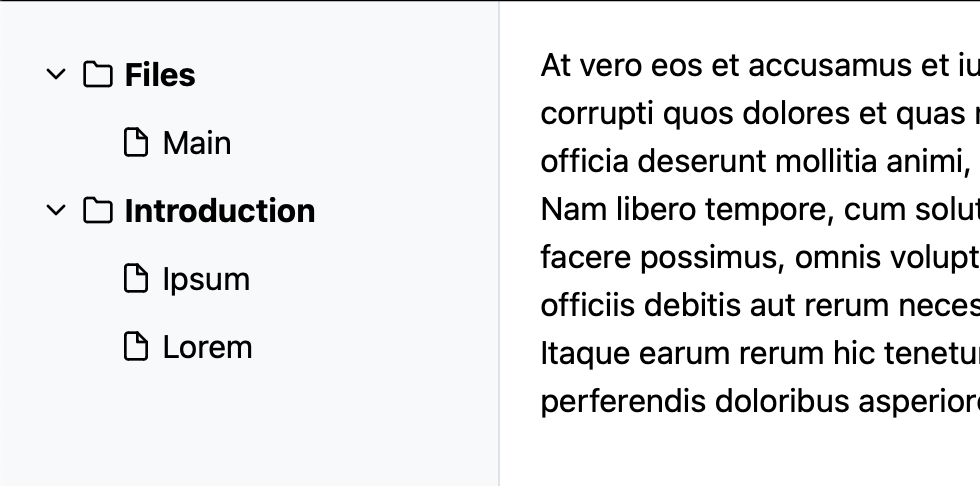

# Docusaurus Alternative Based on React, Tailwind & Parcel



## Overview
This project is a Docusaurus alternative using React, Tailwind CSS, and Parcel. It features a collapsible sidebar for folders and files, dynamically rendering Markdown content.

## Features
- React for building UI
- Tailwind CSS for styling
- Parcel for bundling
- Dynamic Markdown rendering

## Installation
1. Clone the repository:
   ```bash
   git clone https://github.com/kartikmehta8/filer.git
   cd filer
   ```
2. Install dependencies:
   ```bash
   npm install
   ```
3. Generate routes:
   ```bash
   npm run generate-routes
   ```
4. Start the development server:
   ```bash
   npm start
   ```
5. Build the project:
   ```bash
   npm run build
   ```

## Project Structure
```
docusaurus-alternative/
├── public/
│   ├── routes.json
│   ├── index.html
├── src/
│   ├── components/
│   │   ├── Sidebar.js
│   │   ├── MarkdownRenderer.js
│   ├── docs/
│   ├── styles/
│   │   ├── App.css
│   │   ├── Sidebar.css
│   ├── App.js
│   ├── index.js
├── generateRoutes.js
├── package.json
├── .parcelrc
```

By [Mehta](https://mrmehta.in)